# MULTI-MODE INFRARED IMAGE COLORIZATION

This is an implementation of the ["MULTI-MODE INFRARED IMAGE COLORIZATION" paper](https://www.spiedigitallibrary.org/conference-proceedings-of-spie/13196/1319606/Multi-mode-infrared-image-colorization/10.1117/12.3037131.short#_=_).

The code base developed on the [Implementation of **Generating Visible Spectrum Images From Thermal Infrared**](https://github.com/amandaberg/TIRcolorization) 
[Generating Visible Spectrum Images From Thermal Infrared](https://openaccess.thecvf.com/content_cvpr_2018_workshops/w21/html/Berg_Generating_Visible_Spectrum_CVPR_2018_paper.html)  

## How to Run

To execute the code, run code/train.py.

In order to try dual and single modes, you should modify the code (Give zero matrix instead of actual input).

## Results
| | | |
|---|---|---|
| TIR | NIR | LL |
| 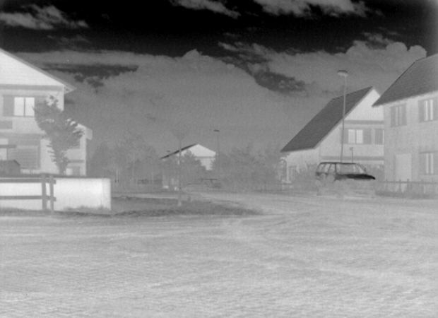 | 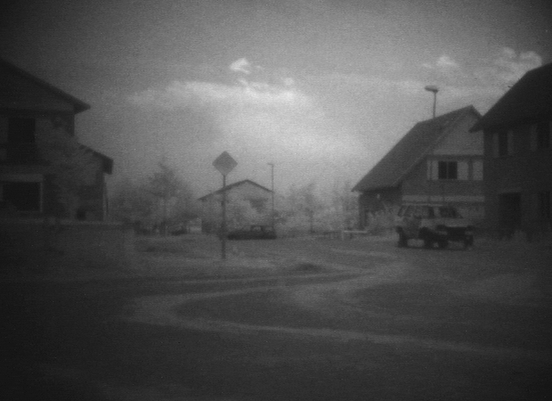 | 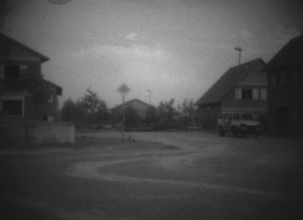 |
| TIR only estimation | NIR only estimation | LL only estimation | 
| 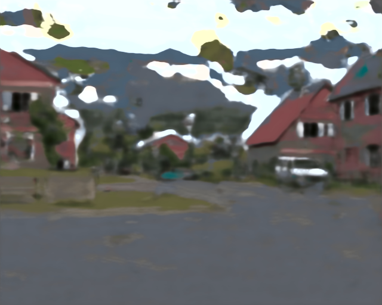 | 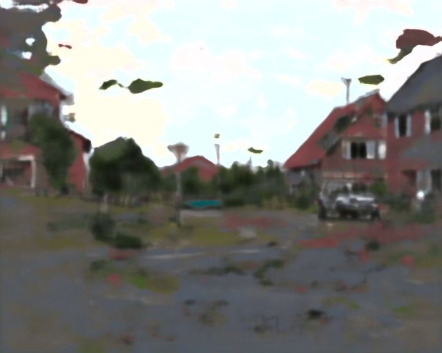 | 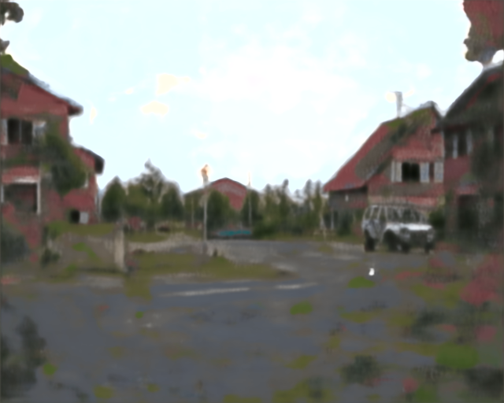 |
| TIR and NIR estimation | TIR and LL estimation | NIR and LL estimation |
| 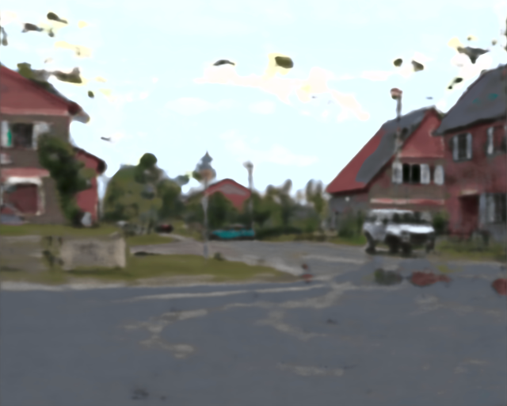 | 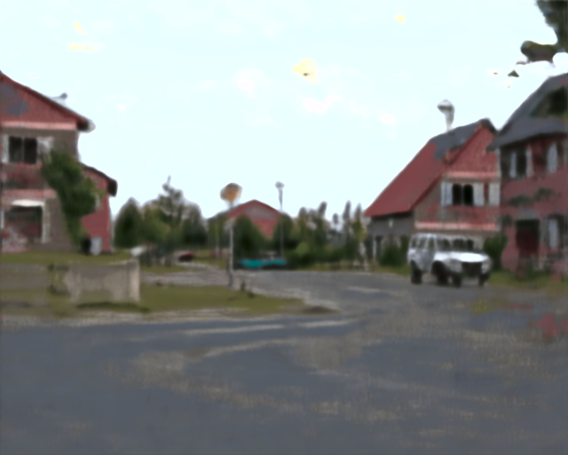 | 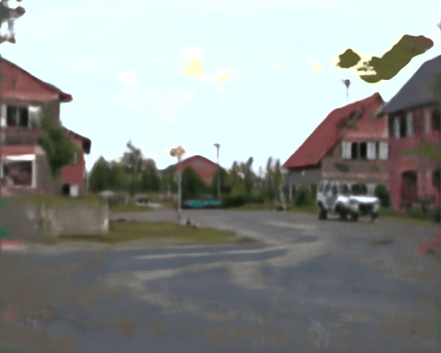 |
| Day-light (ground truth)  | Multi-mode estimation | |
|  | 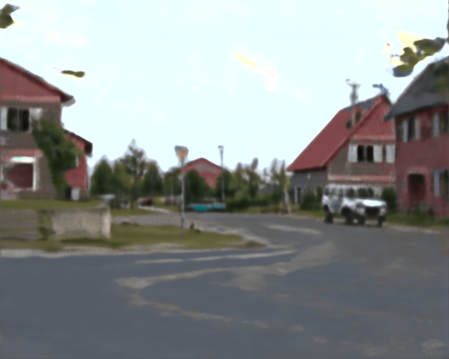 | |

| | | |
|---|---|---|
| TIR | NIR | LL |
| 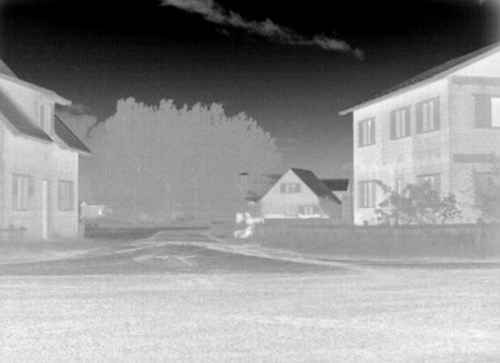 | 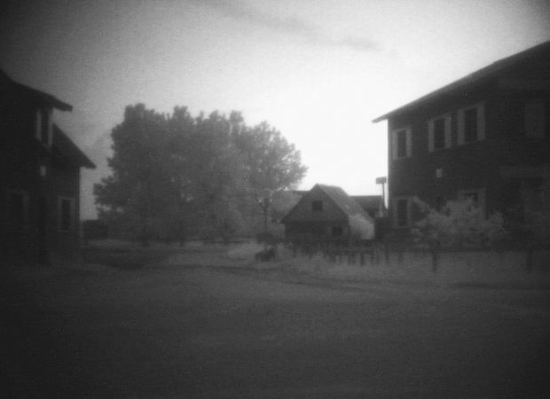 | 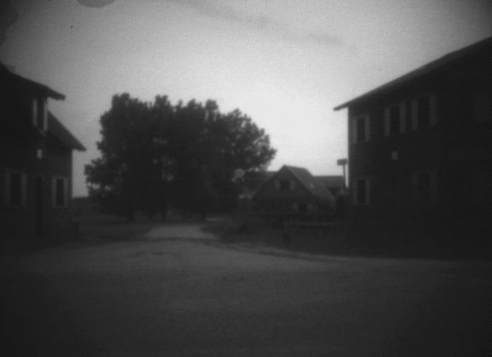 |
| TIR only estimation | NIR only estimation | LL only estimation | 
| 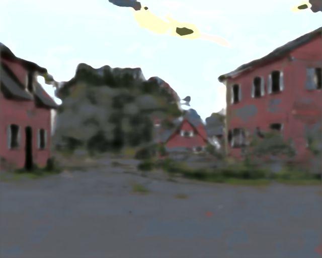 | 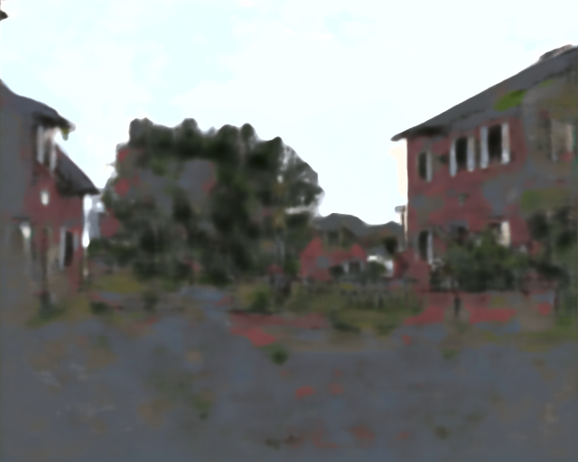 | 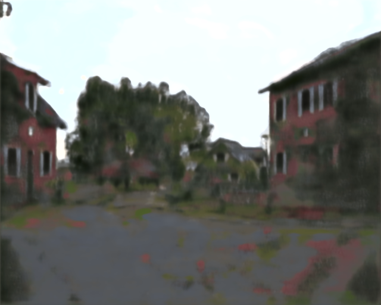 |
| TIR and NIR estimation | TIR and LL estimation | NIR and LL estimation|
| 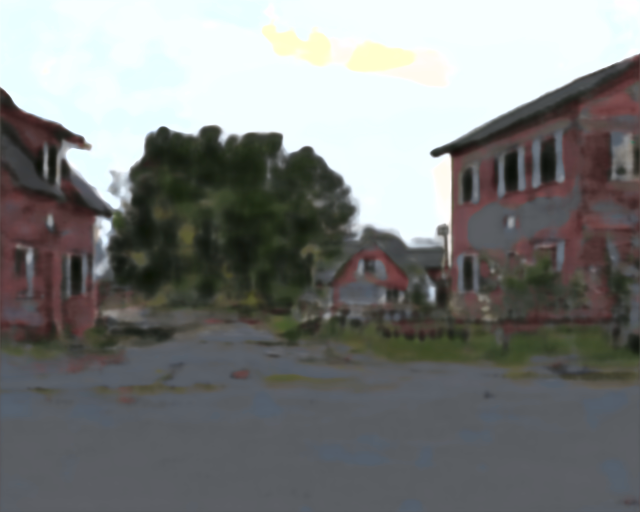 | 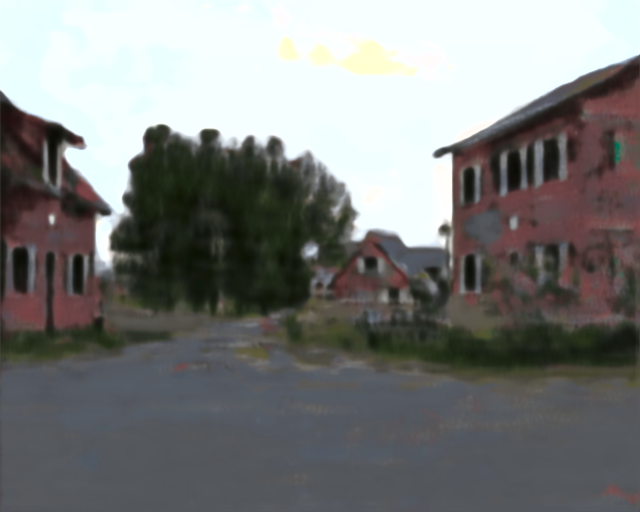 | 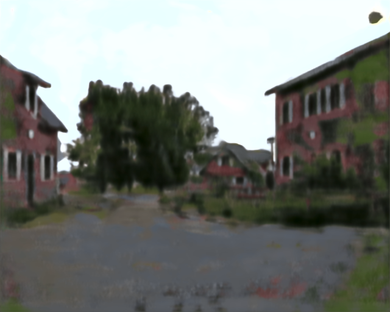 |
| Day-light (ground truth)  | Multi-mode estimation | |
| 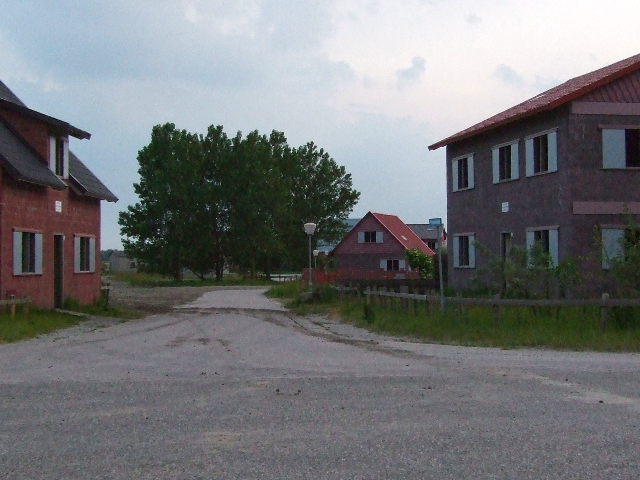 | 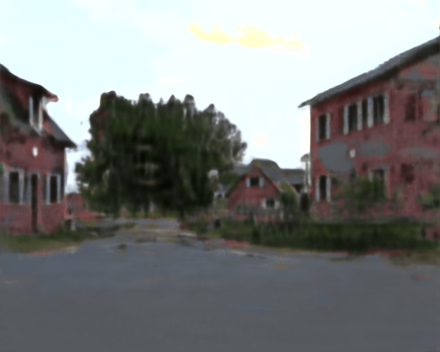 | |
