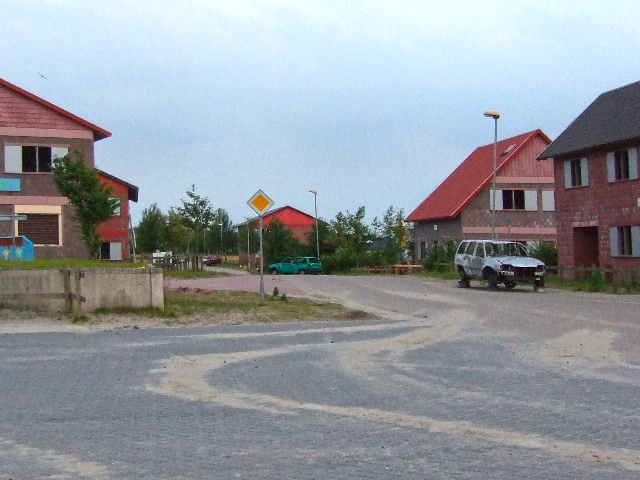

# MULTI-MODE INFRARED IMAGE COLORIZATION
The code will be uploaded when the article is accepted.

## Results
| | | |
|---|---|---|
| Thermal IR | NIR | Low-light |
|  |  |  |
| Day-light (ground truth) |Thermal IR only estimation | Multimode estimation 
|  |  |  |
| Thermal IR + NIR estimation | Thermal IR + Low-light estimation | NIR + low-light estimation|
|  |  |  |

| | | |
|---|---|---|
| Thermal IR | NIR | Low-light |
|  |  |  |
| Day-light (ground truth) |Thermal IR only estimation | Multimode estimation 
|  |  |  |
| Thermal IR + NIR estimation | Thermal IR + Low-light estimation | NIR + low-light estimation |
|  |  |  |